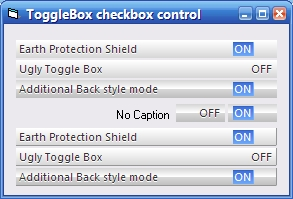



## ToggleBox \- iPhone style Toggle control

### Description

Tired of the [tick] checkbox/toggle. Have a new style funky toggle box control with a couple of gradient back styles, shadow line and caption properties. Great skeleton for an owner drawn custom control too!!
 
### More Info
 

             |
---                |---
**Submitted On**   |2008-12-23 08:50:02
**By**             |[Michael Toye](https://github.com/Planet-Source-Code/PSCIndex/blob/master/ByAuthor/michael-toye.md)
**Level**          |Intermediate
**User Rating**    |4.9 (34 globes from 7 users)
**Compatibility**  |VB 6\.0
**Category**       |[Custom Controls/ Forms/  Menus](https://github.com/Planet-Source-Code/PSCIndex/blob/master/ByCategory/custom-controls-forms-menus__1-4.md)
**World**          |[Visual Basic](https://github.com/Planet-Source-Code/PSCIndex/blob/master/ByWorld/visual-basic.md)
**Archive File**   |[ToggleBox\_21379912232008\.zip](https://github.com/Planet-Source-Code/michael-toye-togglebox-iphone-style-toggle-control__1-71560/archive/master.zip)

